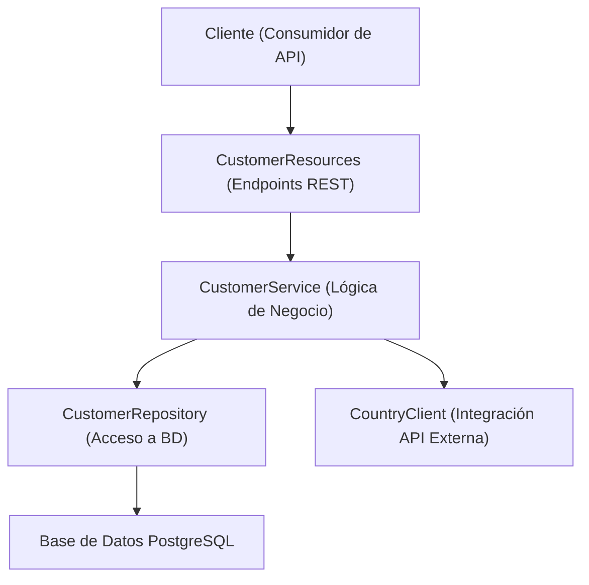

# Gestión de Clientes - Solución RESTful con Quarkus

## Descripción del Proyecto

Este proyecto es una solución RESTful desarrollada en Java con el framework Quarkus, orientada a la gestión de clientes de forma eficiente y segura. La aplicación permite realizar operaciones CRUD (Crear, Consultar, Actualizar y Eliminar) sobre la entidad *Customer*, garantizando la integridad y validez de los datos mediante validaciones y manejo centralizado de excepciones. Además, se integra con el API de RestCountries para obtener el gentilicio a partir del código ISO del país.

---

## Arquitectura del Proyecto

La solución se estructura en las siguientes capas:

- **Modelo:**  
  Define la entidad `Customer` que representa a un cliente.
- **DTOs y Mappers:**  
  Se utilizan objetos de transferencia de datos como `CustomerDto`, `CreateCustomerDto` y `UpdateCustomerDto`, junto con `CustomerMapper` para la conversión entre entidad y DTO.
- **Repositorio:**  
  `CustomerRepository` se encarga del acceso a la base de datos usando Panache.
- **Servicio:**  
  `CustomerService` contiene la lógica de negocio y coordina la integración con el `CountryClient`.
- **Recursos (Endpoints):**  
  `CustomerResources` expone los endpoints REST para realizar las operaciones CRUD.
- **Manejo de Excepciones:**  
  `GlobalExceptionHandler` centraliza la gestión de errores y excepciones.
- **Integración Externa:**  
  `CountryClient` se conecta con el API de RestCountries para obtener el gentilicio según el código ISO del país.

### Diagrama de Arquitectura (Mermaid)


## Endpoints y Operaciones CRUD

### GET /customers/all
- **Descripción:**  
  Obtiene la lista completa de clientes sin paginación.
- **Endpoint:**  
  `GET /customers/all`
- **Respuesta Exitosa:**  
  - **Código HTTP:** 200 OK  
  - **Contenido:** Objeto JSON que incluye un estado, un mensaje y un arreglo de clientes.
- **Ejemplo de Respuesta:**
  ```json
  {
      "status": "success",
      "message": "Clientes obtenidos exitosamente",
      "data": [
          {
              "id": 1,
              "firstName": "John",
              "lastName": "Doe",
              "email": "john.doe@example.com",
              "address": "123 Main St",
              "phone": "123456789",
              "country": "US",
              "demonym": "American"
          },
          {
              "id": 2,
              "firstName": "Jane",
              "lastName": "Smith",
              "email": "jane.smith@example.com",
              "address": "456 Elm St",
              "phone": "987654321",
              "country": "CA",
              "demonym": "Canadian"
          }
      ]
  }
- **Errores Comunes:**
  - 500 Internal Server Error si ocurre algún fallo en el servidor.

---

### GET /customers
- **Descripción:**  
  Obtiene una lista paginada de clientes.
- **Endpoint:**  
  `GET /customers`
- **Parámetros de Consulta:**
  - `page` (opcional, default: 1): Número de la página a obtener.
  - `size` (opcional, default: 10): Cantidad de registros por página.
- **Respuesta Exitosa:**
  - **Código HTTP:** 200 OK
  - **Contenido:** Objeto JSON que incluye los datos de los clientes y la información de paginación.
- **Ejemplo de Respuesta:**
  ```json
  {
      "status": "success",
      "message": "Clientes obtenidos exitosamente",
      "data": [
          {
              "id": 1,
              "firstName": "John",
              "lastName": "Doe",
              "email": "john.doe@example.com",
              "address": "123 Main St",
              "phone": "123456789",
              "country": "US",
              "demonym": "American"
          }
      ],
      "pagination": {
          "page": 1,
          "size": 10,
          "totalElements": 25,
          "totalPages": 3
      }
  }
  ```
- **Errores Comunes:**
  - 400 Bad Request si se suministran parámetros de consulta inválidos.

---

### GET /customers/{id}
- **Descripción:**  
  Retorna los datos de un cliente específico por su ID.
- **Endpoint:**  
  `GET /customers/{id}`
- **Parámetros:**
  - `{id}`: Identificador único del cliente.
- **Respuesta Exitosa:**
  - **Código HTTP:** 200 OK
  - **Contenido:** Objeto JSON que contiene los detalles del cliente.
- **Ejemplo de Respuesta:**
  ```json
  {
      "status": "success",
      "message": "Cliente encontrado",
      "data": {
          "id": 1,
          "firstName": "John",
          "lastName": "Doe",
          "email": "john.doe@example.com",
          "address": "123 Main St",
          "phone": "123456789",
          "country": "US",
          "demonym": "American"
      }
  }
  ```
- **Errores Comunes:**
  - 404 Not Found si no se encuentra un cliente con el ID proporcionado.
  - 400 Bad Request si el ID tiene un formato inválido.

---

### GET /customers/getByEmail
- **Descripción:**  
  Busca un cliente por su dirección de correo electrónico.
- **Endpoint:**  
  `GET /customers/getByEmail`
- **Parámetros de Consulta:**
  - `email`: Dirección de correo electrónico del cliente.
- **Respuesta Exitosa:**
  - **Código HTTP:** 200 OK
  - **Contenido:** Objeto JSON con los detalles del cliente.
- **Ejemplo de Respuesta:**
  ```json
  {
      "status": "success",
      "message": "Cliente encontrado",
      "data": {
          "id": 1,
          "firstName": "John",
          "lastName": "Doe",
          "email": "john.doe@example.com",
          "address": "123 Main St",
          "phone": "123456789",
          "country": "US",
          "demonym": "American"
      }
  }
  ```
- **Errores Comunes:**
  - 404 Not Found si no se encuentra ningún cliente con el correo suministrado.
  - 400 Bad Request si el formato del correo es inválido.

---

### POST /customers
- **Descripción:**  
  Crea un nuevo cliente.
- **Endpoint:**  
  `POST /customers`
- **Cuerpo de la Petición:**  
  Se espera un objeto JSON que cumpla con el formato de `CreateCustomerDto`.
- **Ejemplo de Petición:**
  ```json
  {
      "firstName": "John",
      "middleName": "A.",
      "lastName": "Doe",
      "secondLastName": "Smith",
      "email": "john.doe@example.com",
      "address": "123 Main St",
      "phone": "123456789",
      "country": "US"
  }
  ```
- **Respuesta Exitosa:**
  - **Código HTTP:** 201 Created
  - **Contenido:** Objeto JSON con el estado, un mensaje y los datos del cliente creado.
- **Ejemplo de Respuesta:**
  ```json
  {
      "status": "success",
      "message": "Cliente creado exitosamente",
      "data": {
          "id": 1,
          "firstName": "John",
          "lastName": "Doe",
          "email": "john.doe@example.com",
          "address": "123 Main St",
          "phone": "123456789",
          "country": "US",
          "demonym": "American"
      }
  }
  ```
- **Errores Comunes:**
  - 400 Bad Request si faltan campos obligatorios o si los datos no cumplen con las validaciones (por ejemplo, formato de correo incorrecto).

---

### PUT /customers/{id}
- **Descripción:**  
  Actualiza los datos de un cliente existente. Se permite modificar únicamente el correo, dirección, teléfono y país.
- **Endpoint:**  
  `PUT /customers/{id}`
- **Parámetros:**
  - `{id}`: Identificador único del cliente.
- **Cuerpo de la Petición:**  
  Se espera un objeto JSON que cumpla con el formato de `UpdateCustomerDto`.
- **Ejemplo de Petición:**
  ```json
  {
      "email": "new.email@example.com",
      "address": "New Address 123",
      "phone": "987654321",
      "country": "CA"
  }
  ```
- **Respuesta Exitosa:**
  - **Código HTTP:** 200 OK
  - **Contenido:** Objeto JSON con el estado, un mensaje y los datos actualizados del cliente.
- **Ejemplo de Respuesta:**
  ```json
  {
      "status": "success",
      "message": "Cliente actualizado exitosamente",
      "data": {
          "id": 1,
          "firstName": "John",
          "lastName": "Doe",
          "email": "new.email@example.com",
          "address": "New Address 123",
          "phone": "987654321",
          "country": "CA",
          "demonym": "Canadian"
      }
  }
  ```
- **Errores Comunes:**
  - 404 Not Found si el cliente con el ID proporcionado no existe.
  - 400 Bad Request si los datos de la petición no cumplen con las validaciones.

---

### DELETE /customers/{id}
- **Descripción:**  
  Elimina un cliente a partir de su ID.
- **Endpoint:**  
  `DELETE /customers/{id}`
- **Parámetros:**
  - `{id}`: Identificador único del cliente.
- **Respuesta Exitosa:**
  - **Código HTTP:** 200 OK
  - **Contenido:** Objeto JSON confirmando la eliminación del cliente.
- **Ejemplo de Respuesta:**
  ```json
  {
      "status": "success",
      "message": "Cliente eliminado exitosamente"
  }
  ```
- **Errores Comunes:**
  - 404 Not Found si no se encuentra un cliente con el ID indicado.
  - 400 Bad Request si el formato del ID es inválido.
    
```
## Configuración y Despliegue

### Requisitos Previos
- **Java:** 21 (o la versión configurada en tu toolchain).
- **Build Tool:** Gradle.
- **Base de Datos:** PostgreSQL.

### Configuración
La conexión a la base de datos y otros parámetros se configuran en el archivo `application.properties`:

```properties
# API RestCountries
restcountries.api.url=https://restcountries.com/v3.1/alpha/

# Configuración de PostgreSQL
quarkus.datasource.db-kind=postgresql
quarkus.datasource.username=user
quarkus.datasource.password=password
quarkus.datasource.jdbc.url=jdbc:postgresql://localhost:5432/customers

quarkus.hibernate-orm.database.generation=update

# Configuración del logging
quarkus.log.console.level=INFO
quarkus.log.file.enable=true
quarkus.log.file.path=./logs/application.log
quarkus.log.file.rotation.max-file-size=10M
quarkus.log.file.rotation.max-backup-index=3
```

### Detalle del Build con Gradle

Este es un extracto de tu archivo `build.gradle`:

```gradle
plugins {
    id 'java'
    id 'io.quarkus'
}

repositories {
    mavenCentral()
    mavenLocal()
    maven {
        url 'https://maven.repository.redhat.com/ga/'
    }
}

dependencies {
    implementation enforcedPlatform("${quarkusPlatformGroupId}:${quarkusPlatformArtifactId}:${quarkusPlatformVersion}")
    implementation 'io.quarkus:quarkus-rest'
    implementation 'io.quarkus:quarkus-rest-jackson'
    implementation 'io.quarkus:quarkus-rest-client'
    implementation 'io.quarkus:quarkus-arc'
    implementation 'io.quarkus:quarkus-smallrye-openapi'
    implementation 'io.quarkus:quarkus-hibernate-orm-panache'
    implementation 'io.quarkus:quarkus-jdbc-postgresql'
    implementation 'io.quarkus:quarkus-hibernate-validator'
    implementation 'org.eclipse.microprofile.rest.client:microprofile-rest-client-api:3.0'

    // Testing dependencies
    testImplementation 'io.quarkus:quarkus-junit5'
    testImplementation 'io.quarkus:quarkus-junit5-mockito'
    testImplementation 'io.rest-assured:rest-assured'

    // Mockito dependencies
    testImplementation 'org.mockito:mockito-core:5.5.0'
    testImplementation 'org.mockito:mockito-junit-jupiter:5.5.0'
}

group 'com.wonderDev'
version '1.0-SNAPSHOT'

java {
    toolchain {
        languageVersion.set(JavaLanguageVersion.of(21))
    }
}

test {
    systemProperty "java.util.logging.manager", "org.jboss.logmanager.LogManager"
}

tasks.withType(JavaCompile).configureEach {
    options.encoding = 'UTF-8'
    options.compilerArgs.add('-parameters')
}
```

```markdown
## Requisitos de Instalación y Ejecución

Para poder correr este proyecto, asegúrate de tener instalado y configurado lo siguiente:

- **Java Development Kit (JDK):**  
  Se recomienda instalar JDK 21 (o la versión configurada en el toolchain). Puedes descargarlo desde [Oracle](https://www.oracle.com/java/technologies/javase-downloads.html) o [OpenJDK](https://openjdk.java.net/install/).

- **Gradle:**  
  El proyecto utiliza Gradle como herramienta de construcción. Si no tienes Gradle instalado globalmente, puedes utilizar el wrapper incluido en el proyecto (`./gradlew` en Unix o `gradlew.bat` en Windows).

- **PostgreSQL:**  
  Una instancia de PostgreSQL en ejecución es necesaria para la base de datos.  
  - **Configuración:**  
    - Crea una base de datos (por defecto se espera una base de datos llamada `customers`).
    - Asegúrate de que las credenciales (usuario y contraseña) en el archivo `application.properties` coincidan con tu configuración local.

- **Git:**  
  Para clonar el repositorio del proyecto (opcional, pero recomendado).

### Opcional: Ejecutar la Base de Datos con Docker

Si prefieres no instalar PostgreSQL directamente en tu sistema, puedes ejecutar la base de datos en un contenedor Docker. Asegúrate de tener Docker instalado y en ejecución, y luego ejecuta el siguiente comando:

```bash
docker run --name postgres-db -e POSTGRES_USER=user -e POSTGRES_PASSWORD=password -e POSTGRES_DB=customers -p 5432:5432 -d postgres:latest
```

Este comando realizará lo siguiente:
- Creará y ejecutará un contenedor llamado `postgres-db`.
- Configurará el usuario como `user`, la contraseña como `password` y la base de datos como `customers`.
- Publicará el puerto 5432 para que tu aplicación pueda conectarse a la base de datos.

### Pasos de Instalación y Ejecución

1. **Clonar el Repositorio:**  
   Clona el repositorio en tu máquina local:
   ```bash
   git clone https://tu-repositorio.git
   cd nombre-del-proyecto
   ```

2. **Configurar la Base de Datos:**  
   - Si no utilizas Docker, instala PostgreSQL y crea la base de datos necesaria (por defecto, `customers`).
   - Si utilizas Docker, ejecuta el comando proporcionado para iniciar el contenedor.
   - Modifica el archivo `application.properties` si es necesario, ajustando la URL, usuario y contraseña según tu entorno.

3. **Compilar y Empaquetar el Proyecto:**  
   Ejecuta el siguiente comando para compilar y empaquetar la aplicación:
   ```bash
   ./gradlew build
   ```

4. **Ejecutar el Proyecto en Modo de Desarrollo:**  
   Para ejecutar la aplicación en modo desarrollo (con recarga en caliente):
   ```bash
   ./gradlew quarkusDev
   ```

5. **Ejecutar la Aplicación Empaquetada:**  
   Si deseas ejecutar la aplicación empaquetada, utiliza:
   ```bash
   java -jar build/quarkus-app/quarkus-run.jar
   ```
```

---

## Pruebas Unitarias

El proyecto incluye pruebas unitarias (ubicadas en `CustomerServiceTest.java`) que validan las operaciones principales:

- Creación de un nuevo cliente.
- Consulta de clientes por ID y correo electrónico.
- Actualización y eliminación de clientes.
- Manejo de escenarios de error (por ejemplo, cuando un cliente no se encuentra).

Se utiliza Mockito para simular el comportamiento del repositorio, asegurando la correcta ejecución de la lógica de negocio.

---

## Consideraciones de Diseño

- **Validación de Datos:**  
  Se implementa utilizando Jakarta Bean Validation para asegurar que los campos obligatorios cumplan con criterios como formato y longitud (por ejemplo, formato de correo y tamaño del teléfono).

- **Manejo de Errores:**  
  El `GlobalExceptionHandler` centraliza la captura y respuesta a excepciones, incluyendo errores de validación y casos en que el cliente no se encuentra.

- **Integración con API Externa:**  
  `CountryClient` se encarga de la conexión con el API de RestCountries para obtener el gentilicio basado en el código ISO del país.

- **Estructura en Capas:**  
  La división en capas (modelo, DTO, repositorio, servicio y recursos) mejora la mantenibilidad del código y facilita las pruebas unitarias.

- **Buenas Prácticas:**  
  Se han aplicado patrones de diseño y una arquitectura modular que facilitan futuras ampliaciones y el mantenimiento de la solución.

---

## Conclusión

La solución desarrollada cumple con los requisitos funcionales y no funcionales planteados, proporcionando un sistema robusto, seguro y escalable para la gestión de clientes. La combinación de Quarkus, Hibernate ORM, y la validación de datos garantiza una aplicación eficiente y de fácil mantenimiento.

---
```

